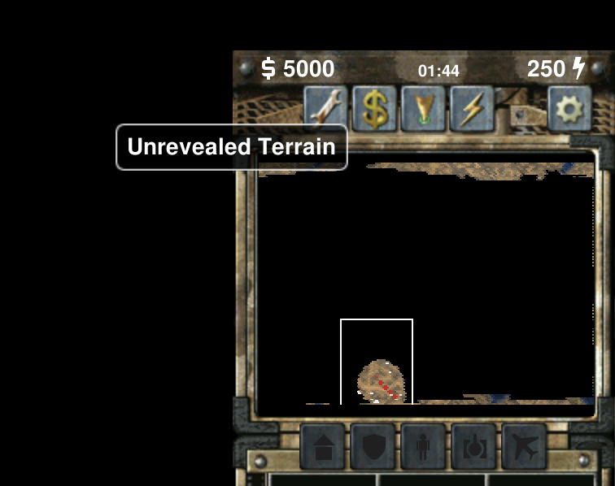
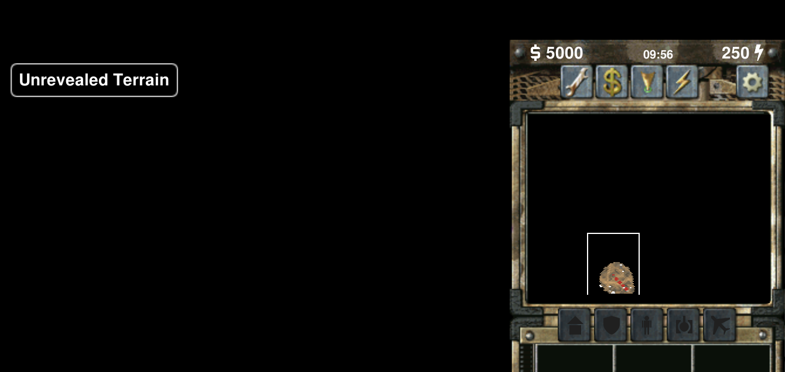

# Human visual verification — 2026-09-14

Sean tested the live baseline and patched Sunstroke scenes on macOS, captured these screenshots, and confirmed the minimap edge bands disappear with the patch. These are the original user-provided screenshot files, without further edits. Framing and elapsed game time differ; this is a visual comparison, not a pixel-synchronized test.

Baseline: f3ec7f8e1593b482f85fd101652deb740c33dee6. Patch:2312e064113463d9c624d875c95d4f462ebe8cdb. The scene uses a preplaced powered GDI radar. Codex prepared/launched the builds; Sean performed this visual check. No additional gameplay, cross-platform, multiplayer, or minimap-input testing is claimed.

| Before | After |
| --- | --- |
|  |  |
